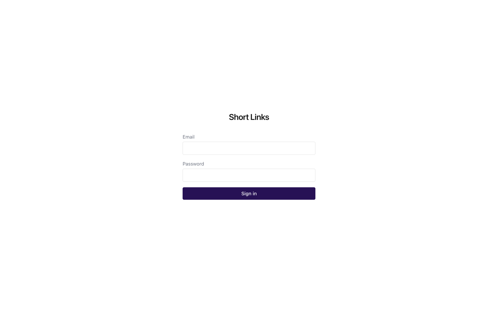
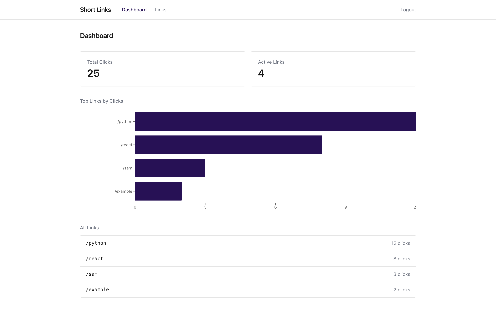
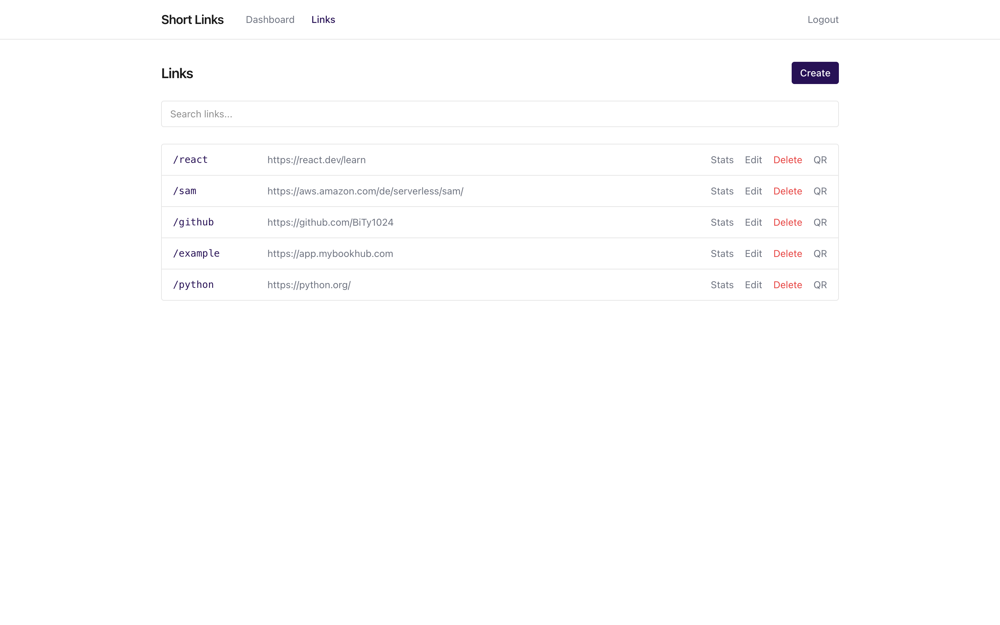
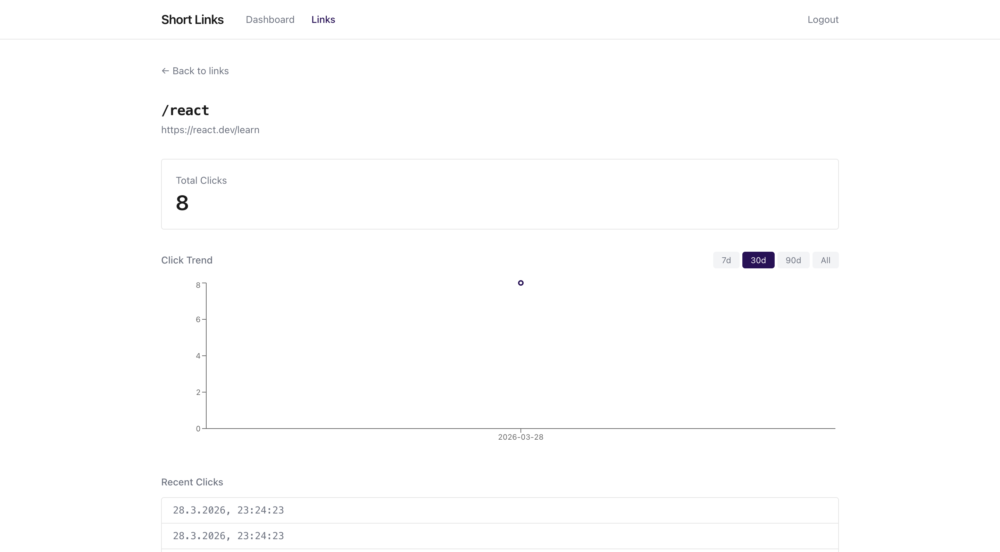

# Serverless Short Link Service

Serverless URL shortener with admin dashboard. For tracking usage of links, creating readable links and flexible integration with other websites while controlling the target. Built with AWS SAM, Python, React, and DynamoDB.

**Live demo**: [admin.short.bookpass.de](https://admin.short.bookpass.de)
View-only login: `demo@short.bookpass.de` / `demo1234`


## Setup

```bash
cp samconfig.example.toml samconfig.toml  # Fill in your values
./deploy.sh                               # Deploys backend + frontend
```

**Prerequisites**: AWS CLI, SAM CLI, Python 3.12, Node.js

## API

All `/api/*` endpoints require `Authorization: Bearer <token>`. Redirects are public.

| Method | Endpoint | Description |
|--------|----------|-------------|
| GET | `/api/links` | List all links |
| POST | `/api/links` | Create link (admin) |
| PUT | `/api/links/{path}` | Update link (admin) |
| DELETE | `/api/links/{path}` | Delete link (admin) |
| GET | `/api/stats` | Click stats overview |
| GET | `/api/stats/{path}` | Stats for one link |

Stats support `?days=N`, `?from=YYYY-MM-DD&to=YYYY-MM-DD`, and `?linked_only=true`.

## Architecture

```
                        ┌──────────────────────────────────────────────┐
                        │           API Gateway (HTTP API)             │
                        │           short.bookpass.de                  │
                        └────┬──────────┬──────────┬───────────────────┘
                             ▼          ▼          ▼
                    ┌───────────┐ ┌──────────┐ ┌───────────┐
                    │ Redirect  │ │  Links   │ │   Stats   │
                    │  Lambda   │ │  Lambda  │ │  Lambda   │
                    │ (public)  │ │  (auth)  │ │  (auth)   │
                    └─────┬─────┘ └────┬─────┘ └─────┬─────┘
                          ▼            ▼             ▼
                    ┌──────────────────────────────────────┐
                    │             DynamoDB                 │
                    │    LinksTable  │  RedirectStatsTable │
                    └──────────────────────────────────────┘

  ┌─────────────────────┐              ┌───────────────────┐
  │   CloudFront + S3   │              │  Cognito (JWT)    │
  │ admin.HOSTEDZONE    │              │  roles            │
  │  React + Tailwind   │              └───────────────────┘
  └─────────────────────┘
```

## Screenshots

### Login

### Dashbord

### Link Managment

### Link stats
