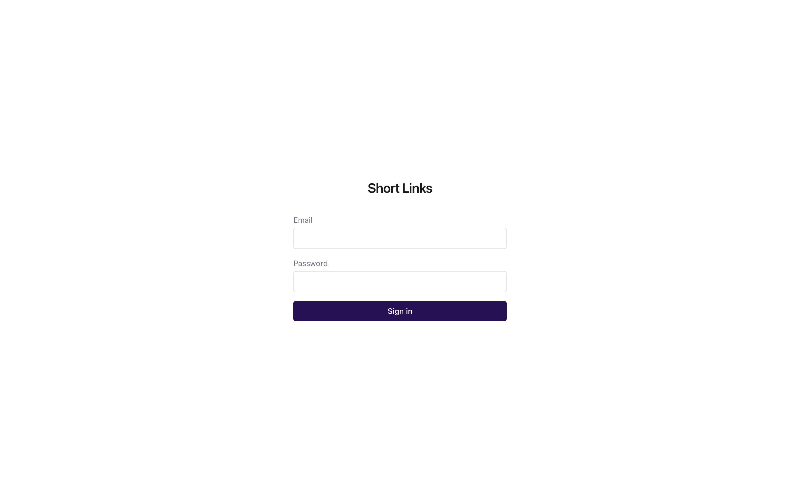
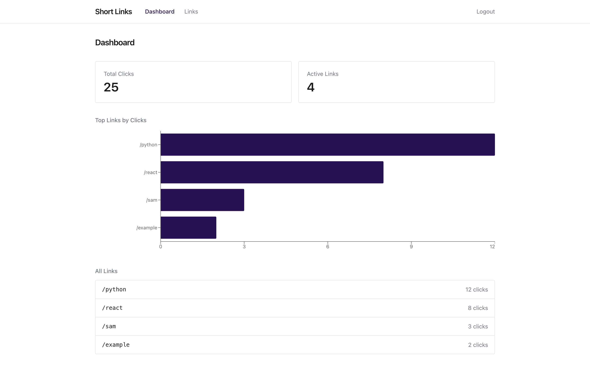
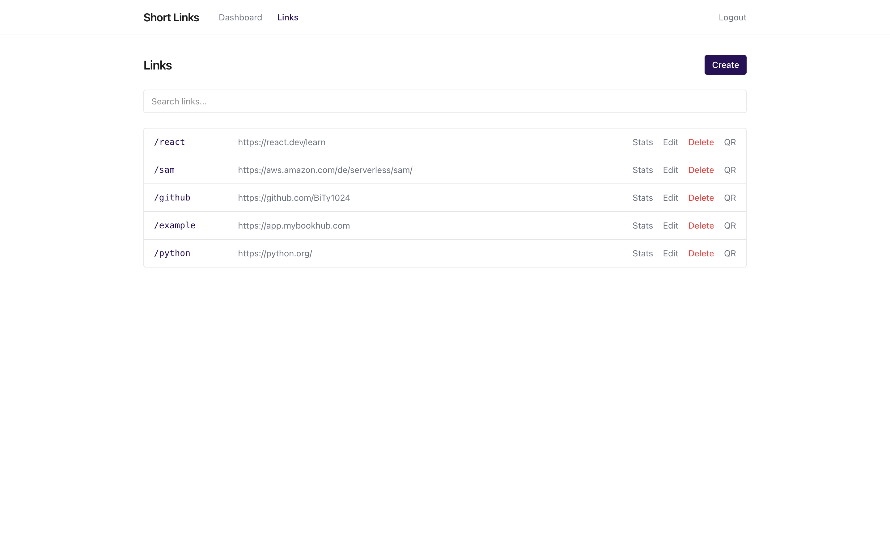
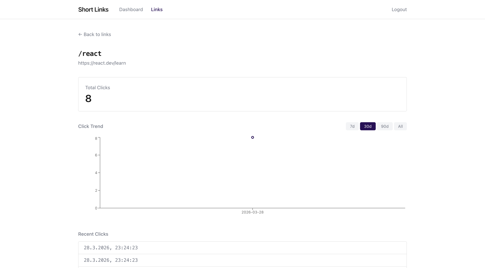

# Serverless Short Link Service

Serverless URL shortener with admin dashboard — create readable short links, control their targets, and track click analytics. Built with Python, React, and DynamoDB on AWS, deployable via **SAM or Terraform**.

**Live demo**: [admin.short.bookpass.de](https://admin.short.bookpass.de)
View-only login: `demo@short.bookpass.de` / `demo1234`

## Highlights

- **Two equivalent IaC paths** — the full stack ships as both an AWS SAM template and a modular Terraform configuration; pick either, get identical infrastructure.
- **Auth & roles** — Cognito JWT authorizer on the API, with `admin` (full CRUD) and `viewer` (read-only) groups.
- **Public redirects, protected admin** — redirect routes are open; every `/api/*` route is authenticated, CORS-locked to the admin origin, and rate-limited per route.
- **Private SPA hosting** — React dashboard served via CloudFront with Origin Access Control over a fully private S3 bucket.
- **Click analytics** — every redirect is recorded to DynamoDB (non-blocking, so tracking never breaks a redirect).
- **Structured logging** — all Lambdas use AWS Lambda Powertools for JSON logs.

> Terraform note: the CloudFront cert (us-east-1) and API cert (regional) are both provisioned natively via provider aliasing + DNS validation — no custom-resource Lambda, unlike the SAM template.


## Setup

Pick one of two deployment paths. Both provision equivalent infrastructure.

### Option A — SAM (default)

```bash
cp samconfig.example.toml samconfig.toml  # Fill in your values
./deploy.sh                               # Deploys backend + frontend
```

**Prerequisites**: AWS CLI, SAM CLI, Python 3.12, Node.js

### Option B — Terraform

```bash
# One-time: bootstrap the remote state backend (S3 + DynamoDB lock)
cd terraform/bootstrap
terraform init && terraform apply -var "state_bucket_name=YOUR-UNIQUE-BUCKET"
# copy the printed backend_config_snippet into terraform/backend.hcl
cd ../..

cp terraform/envs/example.tfvars terraform/envs/myenv.tfvars  # fill in values
./deploy.sh --iac=terraform --config=terraform/envs/myenv.tfvars
```

**Prerequisites**: AWS CLI, Terraform >= 1.6, Python 3.12, Node.js

See [`terraform/README.md`](terraform/README.md) for the resource layout and trade-offs vs. SAM.

## API

All `/api/*` endpoints require `Authorization: Bearer <token>`. Redirects are public.

| Method | Endpoint | Description |
|--------|----------|-------------|
| GET | `/api/links` | List all links |
| POST | `/api/links` | Create link (admin) |
| PUT | `/api/links/{path}` | Update link (admin) |
| DELETE | `/api/links/{path}` | Delete link (admin) |
| GET | `/api/stats` | Click stats overview |
| GET | `/api/stats/{path}` | Stats for one link |

Stats support `?days=N`, `?from=YYYY-MM-DD&to=YYYY-MM-DD`, and `?linked_only=true`.

## Architecture

```
                        ┌──────────────────────────────────────────────┐
                        │           API Gateway (HTTP API)             │
                        │           short.bookpass.de                  │
                        └────┬──────────┬──────────┬───────────────────┘
                             ▼          ▼          ▼
                    ┌───────────┐ ┌──────────┐ ┌───────────┐
                    │ Redirect  │ │  Links   │ │   Stats   │
                    │  Lambda   │ │  Lambda  │ │  Lambda   │
                    │ (public)  │ │  (auth)  │ │  (auth)   │
                    └─────┬─────┘ └────┬─────┘ └─────┬─────┘
                          ▼            ▼             ▼
                    ┌──────────────────────────────────────┐
                    │             DynamoDB                 │
                    │    LinksTable  │  RedirectStatsTable │
                    └──────────────────────────────────────┘

  ┌─────────────────────┐              ┌───────────────────┐
  │   CloudFront + S3   │              │  Cognito (JWT)    │
  │ admin.HOSTEDZONE    │              │  roles            │
  │  React + Tailwind   │              └───────────────────┘
  └─────────────────────┘
```

## Screenshots

### Login

### Dashboard

### Link Management

### Link Stats
